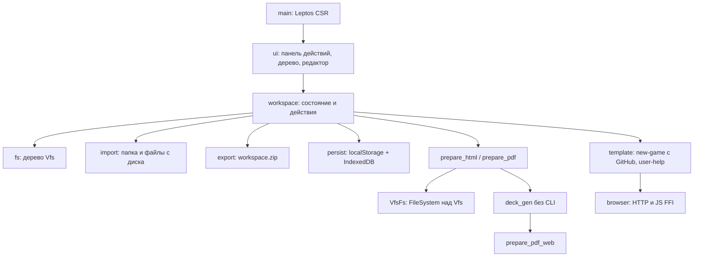

# deck-gen

Браузерный serverless web-assembly via Rust Leptos редактор карточных колод на движке `deck_gen`.

# Архитектура
Схема: [`arch.mermaid`](arch.mermaid).



Технологии: Rust → wasm32, Leptos 0.8 (CSR), Trunk, wasm-bindgen; `deck_gen` без default-features; `prepare_pdf_web`; localStorage / IndexedDB.

# Как собрать

Нужны Rust, цель `wasm32-unknown-unknown`, Trunk (в `start.bat` — 0.21.14). На Windows gcc из WinLibs должен быть раньше LLVM-MinGW в PATH.

Из корня:

```
start.bat
serve.bat
```

Либо вручную:

```
rustup target add wasm32-unknown-unknown
trunk serve
```

Релизная сборка (как GitHub Pages): `trunk build --release`. Артефакты — `deck_gen_wasm/dist/`.

# Как использовать

```
serve.bat
```

Открыть и проектировать локально: http://127.0.0.1:8080 (или `trunk serve` из корня).
