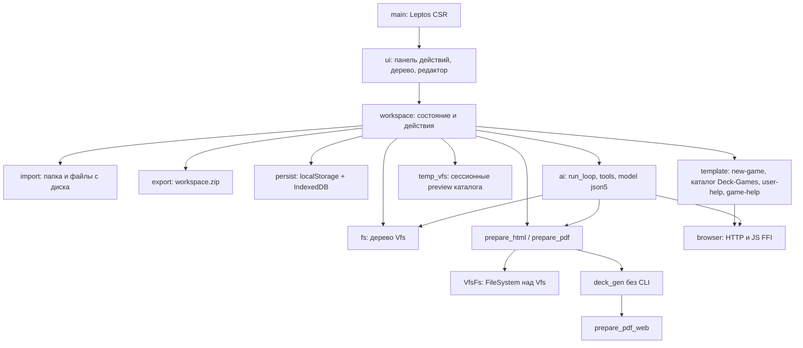

# deck-gen

Браузерный serverless web-assembly via Rust Leptos редактор карточных колод на движке `deck_gen`.

# Архитектура
Схема: [`arch.mermaid`](arch.mermaid).


```mermaid
flowchart TB
  MAIN["main: Leptos CSR"] --> UI["ui: панель действий, дерево, редактор"]
  UI --> WS["workspace: состояние и действия"]
  WS --> VFS["fs: дерево Vfs"]
  WS --> IMP["import: папка и файлы с диска"]
  WS --> EXP["export: workspace.zip"]
  WS --> PER["persist: localStorage + IndexedDB"]
  WS --> TPL["template: new-game, каталог Deck-Games, user-help, game-help"]
  WS --> TEMP["temp_vfs: сессионные preview каталога"]
  WS --> PREP["prepare_html / prepare_pdf"]
  WS --> AI["ai: run_loop, tools, model json5"]
  PREP --> VFSFS["VfsFs: FileSystem над Vfs"]
  PREP --> DG["deck_gen без CLI"]
  DG --> WEB["prepare_pdf_web"]
  TPL --> BR["browser: HTTP и JS FFI"]
  AI --> BR
  AI --> VFS
  AI --> PREP
```

Каталог игр: Globals читает GitHub `AlexeyPerestoronin/Deck-Games` (ветка `master`, папка `Games`); афиши каталога живут в сессионном `temp_vfs` и не персистятся.

AI: при старте приложение копирует `Templates/ai-settings` из GitHub `Deck-Games` в VFS (`*.json5` → `ai-models/`, `*.md` → `help/`), не затирая правки пользователя. Модели — `ai-models/<id>.json5`. Ключ — в json5 или в поле модалки на один запуск (в файл не пишется). Один запрос → цикл инструментов по VFS → лог `ai-models/log/`. Промпты агента — `help/create-game-pt-<en|ru>.md` и `help/edit-game-pt-<en|ru>.md` по типу запроса и локали UI (их можно править в дереве до запуска агента); правила игр — `help/game-help-<en|ru>.md` (как и `user-help` / `ai-help` в папке `help/`).

Технологии: Rust → wasm32, Leptos 0.8 (CSR), Trunk, wasm-bindgen; `deck_gen` без default-features; `prepare_pdf_web`; localStorage / IndexedDB.

# Как собрать

Нужны Rust, цель `wasm32-unknown-unknown`, Trunk (в `start.bat` — 0.21.14). На Windows gcc из WinLibs должен быть раньше LLVM-MinGW в PATH.

Из корня:

```
start.bat
serve.bat
```

Либо вручную:

```
rustup target add wasm32-unknown-unknown
trunk serve
```

Релизная сборка (как GitHub Pages): `trunk build --release`. Артефакты — `deck_gen_wasm/dist/`.

# Как использовать

```
serve.bat
```

Открыть и проектировать локально: http://127.0.0.1:8080 (или `trunk serve` из корня).
