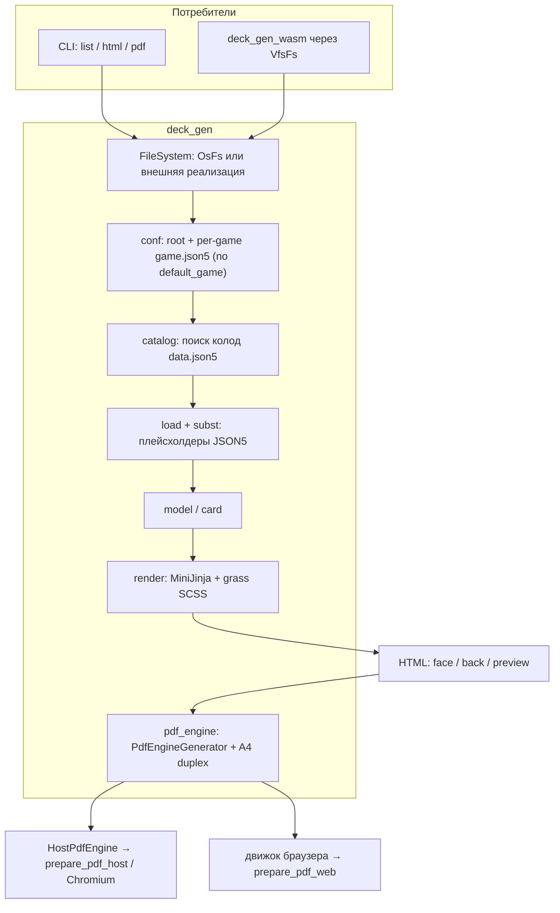

# deck-gen

Ядро генерации колод.

Читает `conf.json5` и `data.json5`, подставляет плейсхолдеры, рендерит лицо/рубашку/preview в HTML.

На нативной машине с фичей `cli` ещё печатает PDF через Chromium (в браузере тот же пайплайн вызывает `deck_gen_wasm` через `FileSystem`).

# Архитектура

Важные моменты:
1. Два уровня конфигурации (default_game в games/conf.json5 удалён):
   1. `conf.json5` в корне проекта (games_root + chrome);
   2. `./games/<game-name>/game.json5` в каталоге каждой игры.

Схема: [`arch.mermaid`](arch.mermaid).



Технологии: Rust, clap, serde/json5, MiniJinja, grass (SCSS), lopdf, thiserror; PDF на хосте — `headless_chrome` через `prepare_pdf_host`.

# Как собрать

Нужны Rust (stable) и Cargo. Для PDF — Chrome или Edge.

Из корня репозитория:

```
cargo build --release -p deck_gen --features cli
```

Либо `start.bat`: поставит toolchain при необходимости, соберёт CLI и скопирует `deck_gen.exe` в корень. WASM-сборки этого крейта — с `--no-default-features`, без Chromium.
