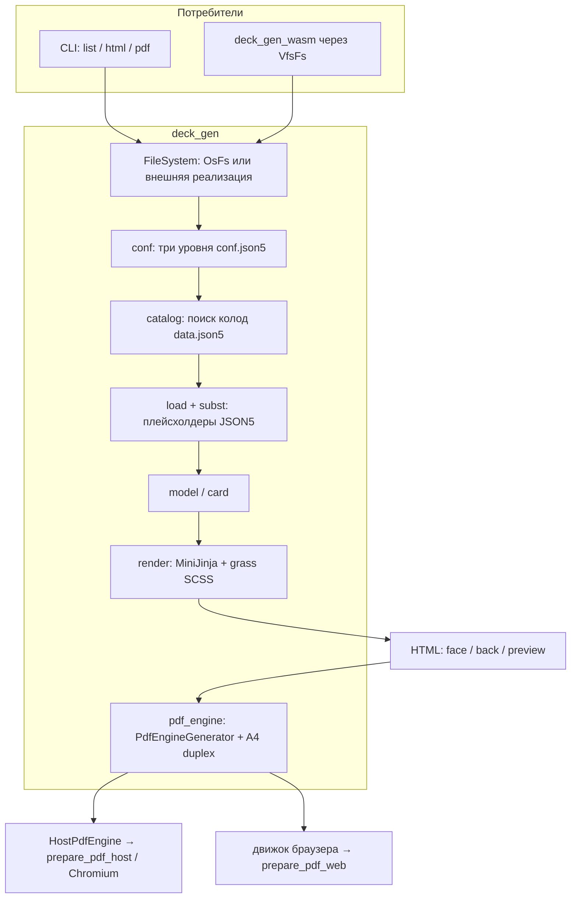

# deck-gen

Ядро генерации колод. Читает `conf.json5` и `data.json5`, подставляет плейсхолдеры, рендерит лицо/рубашку/preview в HTML. На нативной машине с фичей `cli` ещё печатает PDF через Chromium; в браузере тот же пайплайн вызывает `deck_gen_wasm` через `FileSystem`.

# Архитектура

Три уровня конфигурации: корень репозитория (`games_root`, поиск Chrome), каталог игр (`default_game`), папка игры (каталоги, имена артефактов, раскладка A4). Колода — папка с `data.json5`; имя `{id-игры}.{путь.от.decks}`.

Весь I/O идёт через трейт `FileSystem` (`OsFs` в CLI, `VfsFs` в WASM). Движок PDF — трейт `PdfEngineGenerator`: CLI — `HostPdfEngine` (`prepare_pdf_host`), браузер — `prepare_pdf_web`. Duplex-лист собирает `lopdf`.

Схема: [`arch.mermaid`](arch.mermaid).



Технологии: Rust, clap, serde/json5, MiniJinja, grass (SCSS), lopdf, thiserror; PDF на хосте — `headless_chrome` через `prepare_pdf_host`.

# Как собрать

Нужны Rust (stable) и Cargo. Для PDF — Chrome или Edge.

Из корня репозитория:

```
cargo build --release -p deck_gen --features cli
```

Либо `start.bat`: поставит toolchain при необходимости, соберёт CLI и скопирует `deck_gen.exe` в корень. WASM-сборки этого крейта — с `--no-default-features`, без Chromium.

# Как использовать

Бинарник `deck_gen` / `deck_gen.exe` из корня или `target/release/`. Конфиг ищется вверх по каталогам (`conf.json5`).

```
deck_gen list
deck_gen list --json
deck_gen list --name monopoly
deck_gen html
deck_gen html --name monopoly.professions.level_0
deck_gen html --name professions.level_0
deck_gen pdf --name monopoly.events.positives.lucky_day
deck_gen pdf --name monopoly.events.positives.lucky_day --duplex long-edge
```

`--name` — точное имя, имя относительно `default_game` или префикс. `--duplex`: `long-edge` или `short-edge`. HTML/PDF пишутся в `_autogenerated/` игры.
