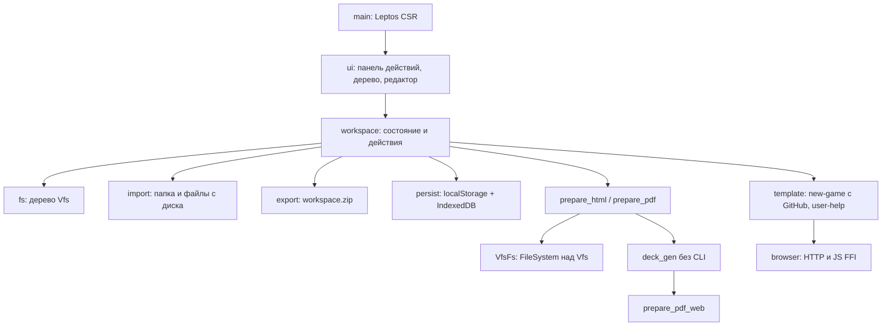

# deck-gen

Браузерный редактор рабочей копии игры: дерево файлов в памяти, правка JSON5/HTML/SCSS/Markdown, вызов того же `deck_gen`, что и CLI, плюс PDF в самой вкладке. Сервера с копией работы нет: сессия в этом браузере, выгрузка — ZIP.

# Архитектура

Точка входа монтирует Leptos CSR (`ui::App`). `workspace` держит VFS, вкладки и действия. `fs` — дерево файлов; `VfsFs` в workspace подставляет его в `deck_gen::FileSystem`. Текст сессии — localStorage, PDF и картинки — IndexedDB. Шаблон `new-game` тянется с GitHub `master`.

Схема: [`arch.mermaid`](arch.mermaid).



Технологии: Rust → wasm32, Leptos 0.8 (CSR), Trunk, wasm-bindgen; `deck_gen` без default-features; `prepare_pdf_web`; localStorage / IndexedDB.

# Как собрать

Нужны Rust, цель `wasm32-unknown-unknown`, Trunk (в `start.bat` — 0.21.14). На Windows gcc из WinLibs должен быть раньше LLVM-MinGW в PATH.

Из корня:

```
start.bat
serve.bat
```

Либо вручную:

```
rustup target add wasm32-unknown-unknown
trunk serve
```

Релизная сборка (как GitHub Pages): `trunk build --release`. Артефакты — `deck_gen_wasm/dist/`.

# Как использовать

```
serve.bat
```

Открыть http://127.0.0.1:8080 (или `trunk serve` из корня).

В интерфейсе: Save / Download ZIP / New game / Load Game / prepare_html / prepare_pdf / Clear. В дереве — файлы и папки, превью html/md/pdf. Справка при первом заходе — `user-help.md`.
